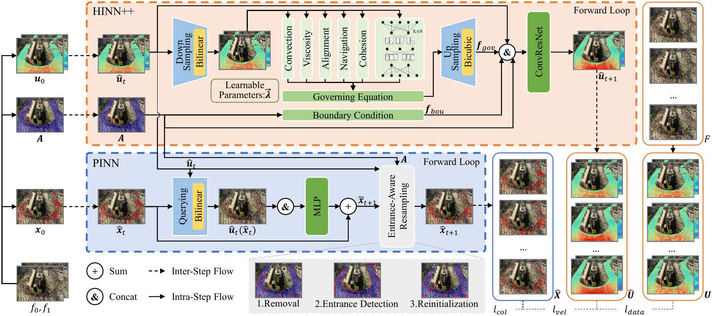

# HINN
Published on ECCV: [ELHINN: Unifying Dense Crowd Simulation Across Scales via Eulerian--Lagrangian Hydrodynamics](https://doi.org/xx.xxxx/xxxxxxx.xxxxxxx)

<p align="center"></p>

## Abstract
Developing effective dense crowd simulation is challenging due to the inherent scale gap between macroscopic collective coherence and microscopic individual realism. 
Existing macroscopic (Eulerian) methods capture global motion patterns but lack individual trajectories, whereas microscopic (Lagrangian) methods model individual behaviors yet often fail to preserve systemic consistency in dense scenarios.
To bridge this gap, we propose the Eulerian--Lagrangian Hydrodynamics-Informed Neural Network (ELHINN), a unified cross-scale framework that explicitly couples macroscopic velocity evolution with microscopic trajectory refinement by using evolved Eulerian velocity fields as physical priors to guide Lagrangian trajectories.
For velocity evolution, we develop an enhanced Hydrodynamics-Informed Neural Network (HINN++) that incorporates a learnable governing equation with Kolmogorov--Arnold Network (KAN) residual correction and environmental boundary conditions, enabling accurate modeling of complex nonlinear dynamics under varying scenarios.
For trajectory refinement, we use a Physics-Informed Neural Network (PINN) augmented with an entrance-aware resampling strategy (EARS) and collision-avoidance constraints to ensure stability and fidelity.
Extensive experiments on two real-world crowd datasets demonstrate that ELHINN outperforms existing methods in simulating dense crowds across both scales.

## Highlights
- We propose a unified cross-scale Eulerian--Lagrangian framework for dense crowd simulation, bridging the fundamental scale gap between global collective coherence and local individual realism.
- We develop a learnable governing equation augmented with KAN residual correction and explicit boundary conditions, enhancing adaptability to diverse crowd dynamics and generalization across scenarios.
- Extensive experiments on two real-world crowd datasets demonstrate the effectiveness of our framework in both macroscopic velocity evolution and microscopic trajectory refinement.

## Requirements
Python  | Pytorch  | Numpy  | OpenCV  | Matplotlib  | Scikit-learn  | SciPy  | Pillow 

## Data Processing
Used datasets: [DCFD](https://github.com/shanshan-zys/HINN) & [MOT20](https://www.codabench.org/competitions/10050/)
```bash
python source/dataset/dcfd/video2frame.py
python source/dataset/dcfd/video2velocity.py
python source/dataset/dcfd/frame2depth.py
python source/dataset/dcfd/frame2mask.py
python source/dataset/dcfd/frame2position.py
python source/dataset/dcfd/mask2area.py
python source/dataset/dcfd/transform_area.py
python source/dataset/mot20/video2frame.py
python source/dataset/mot20/video2velocity.py
python source/dataset/mot20/transform_area.py
python source/dataset/mot20/trajectory2initial.py
```

## Training
```bash
python source/elhinn/hinnpp/run.py
python source/elhinn/pinn/run.py
```

## Evaluation
```bash
python evaluation/transform_heatmap.py
python evaluation/inception_score.py
python evaluation/frechet_inception_distance.py
python evaluation/structural_similarity.py
python evaluation/average_loss.py
python evaluation/joint_distance_error.py
python evaluation/individual_metrics.py
```

## Citation
```bibtex
@inproceedings{zhou2024hydrodynamics,
  title={Hydrodynamics-Informed Neural Network for Simulating Dense Crowd Motion Patterns},
  author={Zhou, Yanshan and Lai, Pingrui and Yu, Jiaqi and Xiong, Yingjie and Yang, Hua},
  booktitle={Proceedings of the 32nd ACM International Conference on Multimedia},
  pages={4553--4561},
  year={2024}
}

@inproceedings{zhou2026elhinn,
  title={ELHINN: Unifying Dense Crowd Simulation Across Scales via Eulerian--Lagrangian Hydrodynamics},
  author={Zhou, Yanshan and Lai, Pingrui and Yu, Jiaqi and Cunyan, Li and Yang, Hua},
  booktitle={European Conference on Computer Vision},
  pages={xxx--xxx},
  year={2026}
}
```
